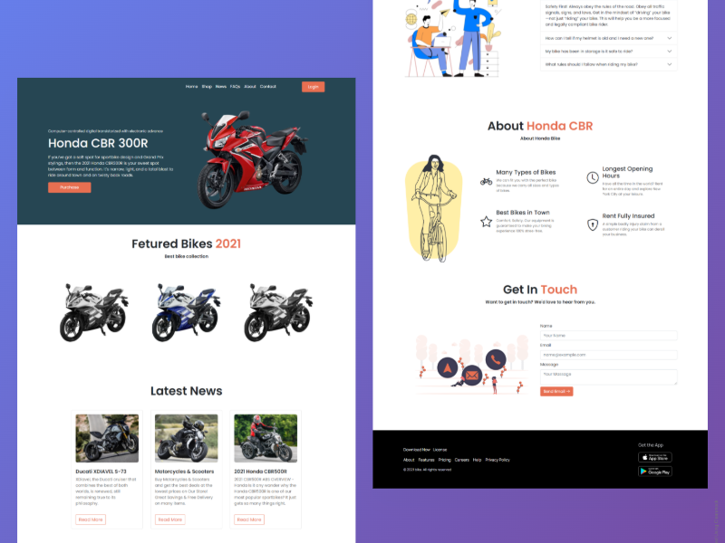

# Bike Store Website Template
> Bike Store Website Bootstrap Design Template.
> Live demo [_here_](https://honda-cbr-bootstrap-emon.netlify.app/).

## Table of Contents
* [General Info](#general-information)
* [Technologies Used](#technologies-used)
* [Features](#features)
* [Screenshots](#screenshots)
* [Setup](#setup)
* [Project Status](#project-status)
* [Acknowledgements](#acknowledgements)
* [Contact](#contact)

## General Information
- Basic Web Design Project Using Bootstrap

## Technologies Used
- Bootstrap - version v5.0.2

## Features
List the ready features here:
- Bike Website Template

## Screenshots

## Setup
Just Clone This Repo, No Need To Setup Any  requirements/dependencies for this product.

## Project Status
Project is:  _complete_ 

## Acknowledgements
Give credit here.
- This project was based on programming hero assignment
- Many thanks to programming hero

## Contact
Created by [@emonahmed](https://www.emonahmed.com/) - feel free to contact me!